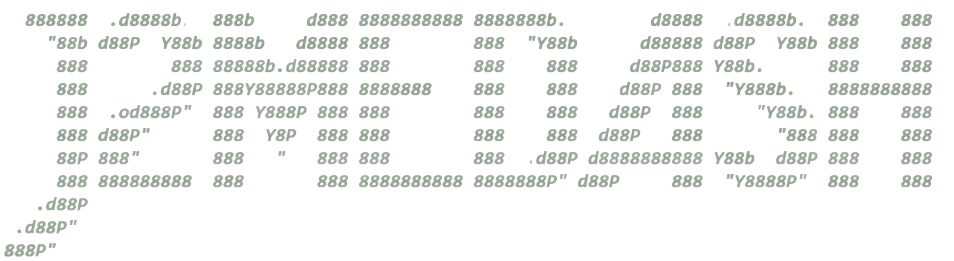

# j2meDash #
j2meDash is a demake version of Geometry Dash ported to Java ME (or J2ME) for Java-supported phones

## WARNING
- This project is still experimental and is in its pre-alpha phase.
- I have only built support for Nokia Asha 311 phone model (resolution 240x400). As for other models, I will add them later in the `main` branch.
- **DO NOT USE OPTION `4` WHEN RUNNING `compile.bat`. The `Nokia_API\` folder is NOT provided in this repository, therefore will cause compilation errors with `build.bat`**

## Prerequisites
- **Java 1.4 SDK** or **Java 8 SDK** (recommend JDK 1.4.2_19 or JDK 8u202)
- **Java ME SDK** (recommend JDK ME 3.4)
- **Sun Java Wireless Toolkit** (recommend WTK 2.5.2_01)

*All can be obtained on Oracle's official website or by using the links listed below*

**Links:**
  - [Java 1.4 SDK SE](https://www.oracle.com/java/technologies/java-archive-javase-v14-downloads.html)
  - [Java 8 SDK](https://www.oracle.com/asean/java/technologies/javase/javase8-archive-downloads.html)
  - [Java ME SDK](https://www.oracle.com/java/technologies/javame-sdk-downloads.html)
  - [Sun Java WTK](https://www.oracle.com/java/technologies/sun-java-wireless-toolkit.html)

*You need to log in your Oracle account to download*

***NOTE:***

- if you're using Windows, download the `.exe` files
- if you're using Linux, choose your appropriate format inside the download table from the links above
- if you're using Mac, use a Virtual Machine

From there, click the `.exe` file to install all three of the SDK

## Compilation (NIGHTLY)

### WINDOWS USERS:
- Step 1: Clone the repository (if you haven't already) using `git clone https://github.com/mnp075075/j2meDash`
- Step 2: Navigate to the project's directory in your terminal (Command Prompt), in this case it's `j2meDash/src/` using `cd`
- Step 3: Compile `j2meDash.java`
  - 3.1: You can compile the source code automatically by running `compile.bat`:
    - You'll be prompted to input a number corresponding to the version of Java you wanted to compile with
    - `1` for Java 1.4, generating `j2meDash4.jar`
    - `2` for Java 8, generating `j2meDash8.jar`
    - `3` for both versions of Java above
    - ~~`4` for Java 1.4 with addition of Nokia APIs, this requires you to have the `Nokia_API\` folder (which can be downloaded from this repo) in `E:` volume (by creating a new partition) so that the dir would be `E:\Nokia_API\`, generating `j2meDash4+NOKIA.jar`~~ (DO NOT CHOOSE THIS OPTION, READ THE <u>[**WARNING SECTION**](#warning)</u> ABOVE)
  - 3.2: Alternatively you can also type each command individually:
    - 3.2.0: Create a new folder named `classes\` inside the  `src\`  directory by doing it manually or type `mkdir classes` in the Command Prompt (with its dir set to the `src\>`)
    - **FOR JAVA 1.4 or JAVA 4**
      - 3.2a.1: Compile `*.class` file
      > `"C:\[your Java 1.4 SDK directory]\bin\javac.exe" -encoding UTF-8 -source 1.3 -target 1.3 -bootclasspath C:\[your WTK directory]\lib\midpapi20.jar;C:\[your WTK directory]\lib\cldcapi11.jar -d classes *.java`
      - 3.2a.2: Preverify `*.class` file to ensure compatibility with older phones
      > `"C:\[your Jave ME SDK directory]\bin\preverify.exe" -classpath classes;C:\[your WTK directory]\lib\midpapi20.jar;C:\[your WTK directory]\lib\cldcapi11.jar -d classes classes\.`
      - 3.2a.3: Package all into a `*.jar` file
      > `"C:\[your Java 1.4 SDK directory]\bin\jar.exe" cfm j2meDashForJava4.jar META-INF\MANIFEST.MF assets levels -C classes .`
    - **FOR JAVA 8**
      - 3.2b.1: Compile `*.class` file
      > `"C:\path\to\JDK_8\bin\javac.exe" -encoding UTF-8 -classpath "C:\[your Java ME SDK directory]\lib\*" -d classes\ *.java`
      - 3.2b.2: Package all into a `*.jar` file
      >  `"C:\path\to\JDK_8\bin\jar.exe" cfm j2meDashForJava8.jar META-INF\MANIFEST.MF assets levels -C classes/ .`

### LINUX AND ONLINE USERS:
- **THE FOLLOWING GUIDES WILL HAVE COMPILATION INSTRUCTIONS ON DEBIAN, ARCH, RED HAT, AND ALPINE DISTRO FAMILY as well as Google Colab (which runs Ubuntu)**
- **INSTALLATION**
- **FOR UBUNTU AND DEBIAN-BASED DISTRO (and Google Colab)**
  - ***Note: If you use Google Colab, make sure to type `!` before every commands, except for `cd` which you will type `%cd` instead***
  - Open the terminal and type `sudo apt-get update` and `sudo apt-get install openjdk-8-jdk` to install JDK 8 **(if you already have Java installed on your device, especially Google Colab, type `!update-alternatives --install /usr/bin/javac javac /usr/lib/jvm/java-8-openjdk-amd64/bin/javac 100`, `!update-alternatives --install /usr/bin/java java /usr/lib/jvm/java-8-openjdk-amd64/jre/bin/java 100`. Then `!update-alternatives --set javac /usr/lib/jvm/java-8-openjdk-amd64/bin/javac` and `!update-alternatives --set java /usr/lib/jvm/java-8-openjdk-amd64/jre/bin/java`. If you use ARM64, change `java-8-openjdk-amd64` to `java-8-openjdk-arm64`)**
- **FOR FEDORA AND RED HAT-BASED DISTRO**
  - Type `sudo dnf install java-1.8.0-openjdk-devel` to install JDK 8 and set it the default one if you have another Java version by `sudo alternatives --config java` and choose the number that correspond to Java 1.8.0
- **FOR ARCH LINUX-BASED DISTRO**
  - Type `sudo pacman -S jdk8-openjdk` and `archlinux-java status` to list every JDK installed, then set Java 8 to default by `sudo archlinux-java set java-8-openjdk`
- **FOR ALPINE LINUX-BASED DISTRO**
  - Install JDK8 by typing `apk add openjdk8` to install then type `ln -sf /usr/lib/jvm/java-1.8-openjdk/bin/java /usr/bin/java` and `ln -sf /usr/lib/jvm/java-1.8-openjdk/bin/javac /usr/bin/javac` to make it default Java version
- **COMPILATION**
  - Step 1: Clone the repo by typing `git clone https://github.com/mnp075075/j2meDash`
  - Step 2: Download these files:
  > [MicroEmulator MIDP 2.0](https://cdn.statically.io/gh/mnp075075/j2meDash@master/lib/midp.jar)
  > [MicroEmulator CLDC 1.1](https://cdn.statically.io/gh/mnp075075/j2meDash@master/lib/cldc.jar)
  > [MicroEmulator JSR 75](https://cdn.statically.io/gh/mnp075075/j2meDash@master/lib/jsr-75.jar)
  - Step 3: Move all these files to the cloned repo directory inside `j2meDash/lib/` by typing `mv midp.jar cldc.jar jsr-75.jar j2meDash/lib/`
  - Step 4: Go to `j2meDash/src/` folder (make sure the cloned repo is in your current path in the terminal) by `cd j2meDash/src/`
  - Step 5: Now you're inside `/j2meDash/src/`, next up type the following to generate class files and package them into `*.jar` file **(note that this is NOT preverified by `preverify` command)**
  > `javac -source 1.4 -target 1.4 -encoding UTF-8 -bootclasspath ../lib/midp.jar:../lib/cldc.jar:../lib/jsr-75.jar -d classes/ *.java`
  > `jar cfm j2meDash4.jar META-INF/MANIFEST.MF assets/ levels/ -C classes/ .`

### MAC USERS:
***Use [VMWare Fusion](https://www.vmware.com/products/desktop-hypervisor/workstation-and-fusion) or [Parallels Desktop](https://www.parallels.com/products/desktop/) to run Windows 11 or Linux in your VM***

## Running
After you successfully compiled the code, there'll be a new file named `j2meDashForJava4.jar` or `j2meDashForJava8.jar`. You can run it using an emulator like FreeJ2ME, FreeJ2ME-plus, etc based on your operating system

Most emulators aren't reliable at running this `.jar` file so just put it on a J2ME-supported phone

***NOTE:*** *You should limit the emulator's FPS to around 30-60 to play smoothly*

## Controls:
**AS OF NOW, SINCE THERE'S ONLY BUILDS FOR NOKIA ASHA 311, there isn't any controls yet, you can just touch the screen to jump and navigate**

`1`: to change speed (in the main menu)

`1`: to change flags (in the play screen) (won't work on emulators like freej2me due to compatibility issues)

`2`: to trigger pause screen (in the play screen)

## Cleaning up:
**WINDOWS**
You can delete the project's directory manually in File Explorer or open the Command Prompt at the project's directory and run `clean.bat`
**LINUX**
You can do it manually
**MACOS**
Same as well